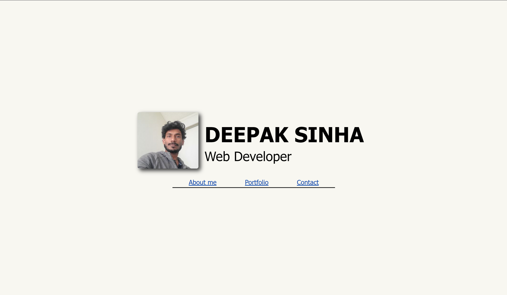

# portfolio
Create a portfolio to showcase projects work and contact details.

## Technology Used 

| Technology Used         | Resource URL           | 
| ------------- |-------------| 
| HTML    | [https://developer.mozilla.org/en-US/docs/Web/HTML](https://developer.mozilla.org/en-US/docs/Web/HTML) | 
| CSS     | [https://developer.mozilla.org/en-US/docs/Web/CSS](https://developer.mozilla.org/en-US/docs/Web/CSS)      |   
| Git | [https://git-scm.com/](https://git-scm.com/)     |    

## Description

[My Portfolio](https://dee-here.github.io/portfolio/)

The task was to build a portfolio site, that would adapt to different screen sizes and be responsive. Media queries were used to handle layout changs as the screen size changes.

CSS variables were used to easily modify and maintain values across the CSS files.

The header was designed such that it always takes up all the viewport when the page first loads. Users can use the navigation links in the header to easily access other sections on the page.

Flexbox was used to position and flow content around the page as the screen size changes.
Absolute positoning helped display the titles on the project tiles.

## Screenshots

## Author Info

Deepak Sinha

* [Portfolio](https://dee-here.github.io/portfolio/)
* [Github](https://github.com/dee-here)

## License

MIT License

Copyright (c) [2023] [deepak sinha]

Permission is hereby granted, free of charge, to any person obtaining a copy
of this software and associated documentation files (the "Software"), to deal
in the Software without restriction, including without limitation the rights
to use, copy, modify, merge, publish, distribute, sublicense, and/or sell
copies of the Software, and to permit persons to whom the Software is
furnished to do so, subject to the following conditions:

The above copyright notice and this permission notice shall be included in all
copies or substantial portions of the Software.

THE SOFTWARE IS PROVIDED "AS IS", WITHOUT WARRANTY OF ANY KIND, EXPRESS OR
IMPLIED, INCLUDING BUT NOT LIMITED TO THE WARRANTIES OF MERCHANTABILITY,
FITNESS FOR A PARTICULAR PURPOSE AND NONINFRINGEMENT. IN NO EVENT SHALL THE
AUTHORS OR COPYRIGHT HOLDERS BE LIABLE FOR ANY CLAIM, DAMAGES OR OTHER
LIABILITY, WHETHER IN AN ACTION OF CONTRACT, TORT OR OTHERWISE, ARISING FROM,
OUT OF OR IN CONNECTION WITH THE SOFTWARE OR THE USE OR OTHER DEALINGS IN THE
SOFTWARE.